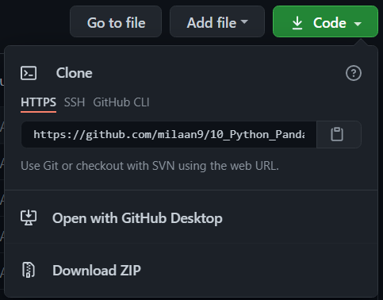

 
 
 
 

 </a> 

 
<!---->
 
 
# 10_Python_Pandas_Module

## Introduction 👋

### What is Pandas in Python?
 is the most famous python library which is utilized for data analysis. Pandas render extremely optimized performance with back-end source code which is written totally in C or Python. Also, using pandas you can easily familiar with your data by cleaning, transforming, and analyzing it.

In Pandas, the data is usually utilized to support statistical analysis in SciPy, plotting functions from Matplotlib, and machine learning algorithms in Scikit-learn.

### Core Components of Pandas Data Structure
Pandas have two core data structure components, and all operations are based on those two objects. Organizing data in a particular way is known as a data structure. Here are the two pandas data structures:

* **Series**
* **DataFrame**

## Table of contents 📋

[001_Python_Pandas_DataFrame](https://github.com/milaan9/10_Python_Pandas_Module/blob/main/001_Python_Pandas_DataFrame.ipynb)

 - [001_Python_Pandas_DataFrame_from_Dictionary](https://github.com/milaan9/10_Python_Pandas_Module/blob/main/001_Python_Pandas_Methods/001_Python_Pandas_DataFrame_from_Dictionary.ipynb)
   
 - [002_Python_Pandas_DataFrame_from_List](https://github.com/milaan9/10_Python_Pandas_Module/blob/main/001_Python_Pandas_Methods/002_Python_Pandas_DataFrame_from_List.ipynb)
   
 - [003_Python_Pandas_DataFrame_head()_and_tail()](https://github.com/milaan9/10_Python_Pandas_Module/blob/main/001_Python_Pandas_Methods/003_Python_Pandas_DataFrame_head()_and_tail().ipynb)
   
 - [004_Python_Pandas_DataFrame_drop_columns](https://github.com/milaan9/10_Python_Pandas_Module/blob/main/001_Python_Pandas_Methods/004_Python_Pandas_DataFrame_drop_columns.ipynb)
   
 - [005_Python_Pandas_DataFrame_drop_duplicates](https://github.com/milaan9/10_Python_Pandas_Module/blob/main/001_Python_Pandas_Methods/005_Python_Pandas_DataFrame_drop_duplicates.ipynb)
   
 - [006_Python_Pandas_DataFrame_drop_columns_with_NA](https://github.com/milaan9/10_Python_Pandas_Module/blob/main/001_Python_Pandas_Methods/006_Python_Pandas_DataFrame_drop_columns_with_NA.ipynb)
   
 - [007_Python_Pandas_DataFrame_rename_columns](https://github.com/milaan9/10_Python_Pandas_Module/blob/main/001_Python_Pandas_Methods/007_Python_Pandas_DataFrame_rename_columns.ipynb)
   
 - [008_Python_Pandas_DataFrame_to_Python_dictionary](https://github.com/milaan9/10_Python_Pandas_Module/blob/main/001_Python_Pandas_Methods/008_Python_Pandas_DataFrame_to_Python_dictionary.ipynb)
   
 - [009_Python_Pandas_DataFrame_set_index](https://github.com/milaan9/10_Python_Pandas_Module/blob/main/001_Python_Pandas_Methods/009_Python_Pandas_DataFrame_set_index.ipynb)
   
 - [010_Python_Pandas_DataFrame_reset_index](https://github.com/milaan9/10_Python_Pandas_Module/blob/main/001_Python_Pandas_Methods/010_Python_Pandas_DataFrame_reset_index.ipynb)

[002_Python_Pandas_Exercise_1](https://github.com/milaan9/10_Python_Pandas_Module/blob/main/002_Python_Pandas_Exercise_1.ipynb)

[003_Python_Pandas_Exercise_2](https://github.com/milaan9/10_Python_Pandas_Module/blob/main/003_Python_Pandas_Exercise_2.ipynb)

[automobile_data.csv](https://github.com/milaan9/10_Python_Pandas_Module/blob/main/automobile_data.csv)

[pokemon_data.csv](https://github.com/milaan9/10_Python_Pandas_Module/blob/main/pokemon_data.csv)

[Pandas Cheat Sheet Data Wrangling in Python.pdf](https://github.com/milaan9/10_Python_Pandas_Module/blob/main/Pandas%20Cheat%20Sheet%20Data%20Wrangling%20in%20Python.pdf)

[Pandas Cheat Sheet for Data Science in Python.pdf](https://github.com/milaan9/10_Python_Pandas_Module/blob/main/Pandas%20Cheat%20Sheet%20for%20Data%20Science%20in%20Python.pdf)

## Main Features
Here are just a few of the things that pandas does well:

  - Easy handling of [**missing data**][missing-data] (represented as
    `NaN`) in floating point as well as non-floating point data
  - Size mutability: columns can be [**inserted and
    deleted**][insertion-deletion] from DataFrame and higher dimensional
    objects
  - Automatic and explicit [**data alignment**][alignment]: objects can
    be explicitly aligned to a set of labels, or the user can simply
    ignore the labels and let `Series`, `DataFrame`, etc. automatically
    align the data for you in computations
  - Powerful, flexible [**group by**][groupby] functionality to perform
    split-apply-combine operations on data sets, for both aggregating
    and transforming data
  - Make it [**easy to convert**][conversion] ragged,
    differently-indexed data in other Python and NumPy data structures
    into DataFrame objects
  - Intelligent label-based [**slicing**][slicing], [**fancy
    indexing**][fancy-indexing], and [**subsetting**][subsetting] of
    large data sets
  - Intuitive [**merging**][merging] and [**joining**][joining] data
    sets
  - Flexible [**reshaping**][reshape] and [**pivoting**][pivot-table] of
    data sets
  - [**Hierarchical**][mi] labeling of axes (possible to have multiple
    labels per tick)
  - Robust IO tools for loading data from [**flat files**][flat-files]
    (CSV and delimited), [**Excel files**][excel], [**databases**][db],
    and saving/loading data from the ultrafast [**HDF5 format**][hdfstore]
  - [**Time series**][timeseries]-specific functionality: date range
    generation and frequency conversion, moving window statistics,
    moving window linear regressions, date shifting and lagging, etc.

   [missing-data]: https://pandas.pydata.org/pandas-docs/stable/missing_data.html#working-with-missing-data
   [insertion-deletion]: https://pandas.pydata.org/pandas-docs/stable/dsintro.html#column-selection-addition-deletion
   [alignment]: https://pandas.pydata.org/pandas-docs/stable/dsintro.html?highlight=alignment#intro-to-data-structures
   [groupby]: https://pandas.pydata.org/pandas-docs/stable/groupby.html#group-by-split-apply-combine
   [conversion]: https://pandas.pydata.org/pandas-docs/stable/dsintro.html#dataframe
   [slicing]: https://pandas.pydata.org/pandas-docs/stable/indexing.html#slicing-ranges
   [fancy-indexing]: https://pandas.pydata.org/pandas-docs/stable/indexing.html#advanced-indexing-with-ix
   [subsetting]: https://pandas.pydata.org/pandas-docs/stable/indexing.html#boolean-indexing
   [merging]: https://pandas.pydata.org/pandas-docs/stable/merging.html#database-style-dataframe-joining-merging
   [joining]: https://pandas.pydata.org/pandas-docs/stable/merging.html#joining-on-index
   [reshape]: https://pandas.pydata.org/pandas-docs/stable/reshaping.html#reshaping-and-pivot-tables
   [pivot-table]: https://pandas.pydata.org/pandas-docs/stable/reshaping.html#pivot-tables-and-cross-tabulations
   [mi]: https://pandas.pydata.org/pandas-docs/stable/indexing.html#hierarchical-indexing-multiindex
   [flat-files]: https://pandas.pydata.org/pandas-docs/stable/io.html#csv-text-files
   [excel]: https://pandas.pydata.org/pandas-docs/stable/io.html#excel-files
   [db]: https://pandas.pydata.org/pandas-docs/stable/io.html#sql-queries
   [hdfstore]: https://pandas.pydata.org/pandas-docs/stable/io.html#hdf5-pytables
   [timeseries]: https://pandas.pydata.org/pandas-docs/stable/timeseries.html#time-series-date-functionality

These are online read-only versions.

## Frequently asked questions ❔

### How can I thank you for writing and sharing this tutorial? 🌷

You can  Starring is free for you, but it tells me and other people that it was helpful and you like this tutorial.

Go [here](https://github.com/milaan9/10_Python_Pandas_Module) if you aren't here already and click the "⭐ Star" button in the top right corner. You will be asked to create a GitHub account if you don't already have one.

### How can I read this tutorial without an Internet connection? 

1. Go [here](https://github.com/milaan9/10_Python_Pandas_Module) if you aren't here already.
    
2. Click the big green "Clone or download" button in the top right of the page, then click "[Download ZIP](https://github.com/milaan9/10_Python_Pandas_Module/archive/refs/heads/main.zip)".

    

3. Extract the ZIP and open it. Unfortunately I don't have any more specific instructions because how exactly this is done depends on which operating system you run.
    
4. Launch ipython notebook from the folder which contains the notebooks. Open each one of them
  
    `Cell > All Output > Clear`
    
This will clear all the outputs and now you can understand each statement and learn interactively.

If you have git and you know how to use it, you can also clone the repository instead of downloading a zip and extracting it. An advantage with doing it this way is that you don't need to download the whole tutorial again to get the latest version of it, all you need to do is to pull with git and run ipython notebook again.

## Authors ✍️

I'm Dr. Milaan Parmar and I have written this tutorial. If you think you can add/correct/edit and enhance this tutorial you are most welcome🙏

See [github's contributors page](https://github.com/milaan9/10_Python_Pandas_Module/graphs/contributors) for details.

If you have trouble with this tutorial please tell me about it by [Create an issue on GitHub](https://github.com/milaan9/10_Python_Pandas_Module/issues/new). and I'll make this tutorial better. This is probably the best choice if you had trouble following the tutorial, and something in it should be explained better. You will be asked to create a GitHub account if you don't already have one.

If you like this tutorial, please [give it a ⭐ star](https://github.com/milaan9/10_Python_Pandas_Module).

## Licence 📜

You may use this tutorial freely at your own risk. See [LICENSE](./LICENSE).

